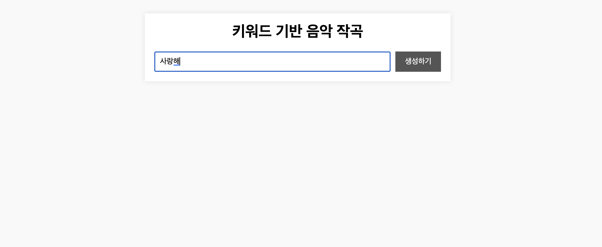
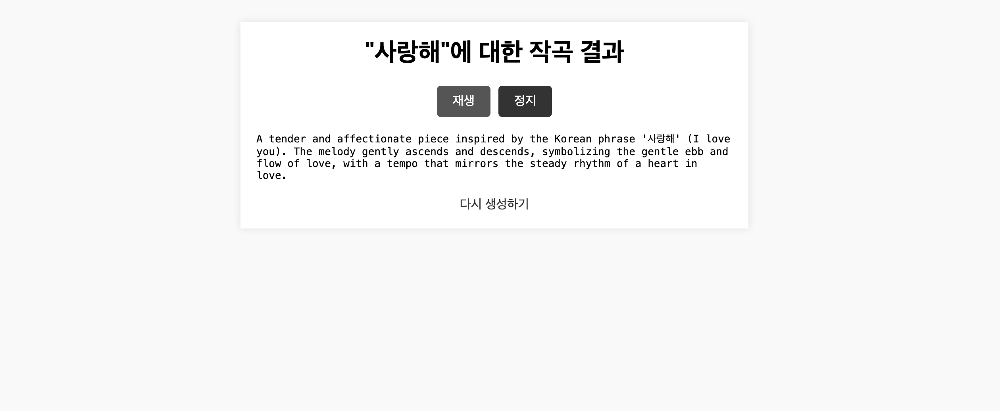
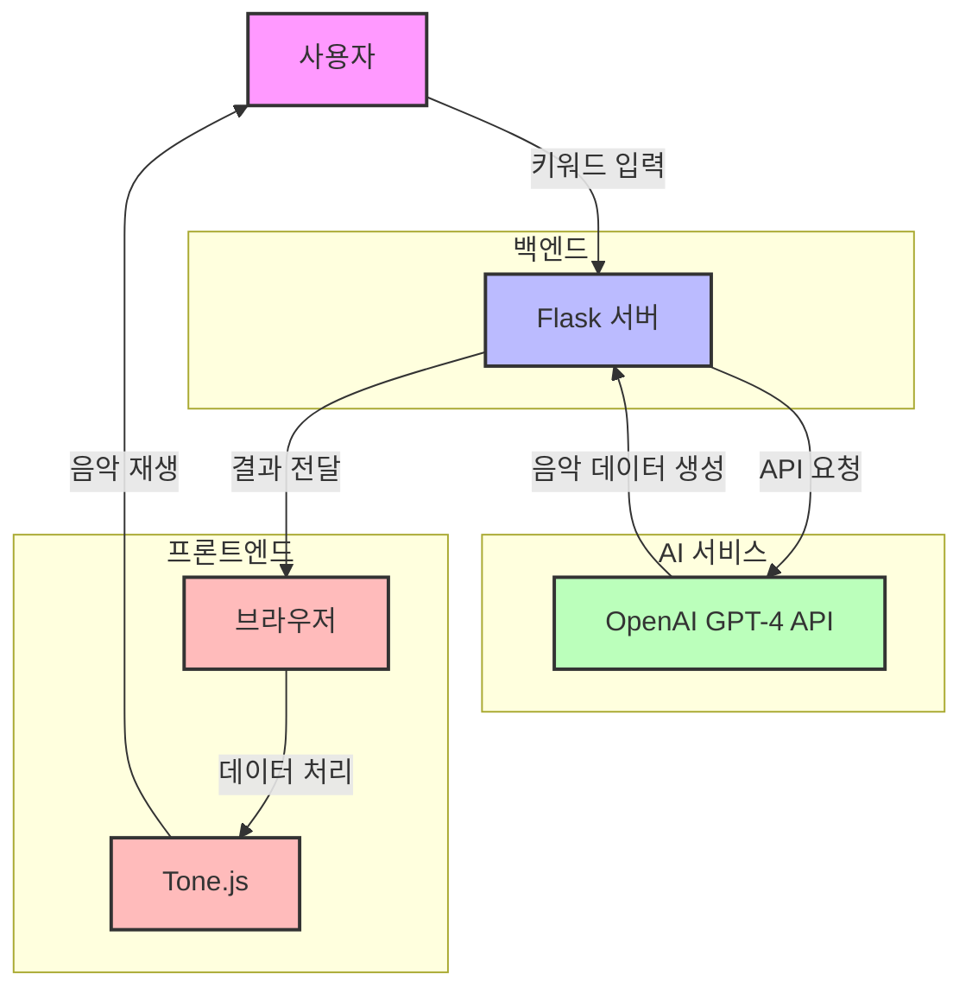

# 🎵 AI 키워드 작곡 앱 (AI Keyword Composer)

키워드를 입력하면 AI가 간단한 멜로디를 작곡해주는 웹 애플리케이션입니다. GPT-4 API를 활용하여 키워드에 맞는 음악적 설명과 멜로디를 생성하고, Tone.js를 통해 브라우저에서 직접 재생할 수 있습니다.

## 주요 기능

- 사용자 키워드 기반 멜로디 생성
- 생성된 멜로디 작곡 음악 플레이 제공
- 음악에 대한 설명 제공
- 심플하고 직관적인 사용자 인터페이스

## 기술 스택

- **Backend**
  - Python 3.12.1
  - Flask 2.3.2
  - OpenAI API (GPT-4)
- **Frontend**
  - HTML/CSS
  - Vanilla JavaScript
  - Tone.js (웹 오디오 라이브러리)

## 설치 방법

1. 저장소 클론

```bash
git clone https://github.com/lsm-algorithmic-enjoy/Term-Project-OSS-.git

cd Term-Project-OSS-
```

2. 필요한 패키지 설치

```bash
pip install -r requirements.txt
```

3. 환경 변수 설정

- `.env` 파일을 생성하고 OpenAI API 키를 설정합니다.

4. 애플리케이션 실행

```bash
python main.py
```

## 사용 방법

1. 웹 브라우저에서 `http://127.0.0.1:5000/` 접속
2. 원하는 키워드 입력 (예: 봄, 별빛, 바다)
3. "생성하기" 버튼 클릭



4. 생성된 멜로디를 "재생/정지" 버튼으로 제어
5. "다시 생성하기" 링크를 통해 초기화면으로 복귀하여 새로운 키워드로 작곡 가능



## 시연 영상 링크 (템포 조절 가능 시연)

## 시스템 아키텍처



### 시스템 아키텍처 플로우 설명

1. 사용자가 웹 인터페이스를 통해 키워드 입력
2. Flask 서버가 요청을 받아 OpenAI GPT-4 API로 전달
3. GPT-4가 키워드를 기반으로 음악 데이터 생성
4. 생성된 데이터가 Flask 서버를 통해 클라이언트로 전송
5. Tone.js가 브라우저에서 음악 데이터를 해석하여 재생

## 프로젝트 구조

```
.
├── main.py              # Flask 애플리케이션 메인 파일
├── templates/           # HTML 템플릿
│   ├── index.html      # 메인 페이지
│   └── result.html     # 결과 페이지
├── static/             # 정적 파일
│   ├── style.css      # 스타일시트
│   └── player.js      # 음악 재생 관련 스크립트
├── requirements.txt    # 프로젝트 의존성
└── .env               # 환경 변수 파일(API 키 저장)
```

## 기술적 세부사항

- GPT-4 API를 사용하여 C4부터 C5까지의 음계로 8-16개의 음표로 구성된 멜로디 생성
- Tone.js를 활용하여 브라우저 기반 음악 재생
- Flask 서버에서 OpenAI API와 통신하여 작곡 데이터 생성

## 주의사항

- 제가 사용하는 API 키는 프로젝트 시연 및 데모 목적으로만 제공합니다. API 키를 이 저장소 외 다른 환경에 직접 노출하지 않도록 주의하세요.
- GPT-4 API는 사용량 제한이 있습니다. (현재 유료버전 사용중)
- 이 프로젝트는 가급적 최신 크롬 브라우저 버전에서 실행하기를 권장합니다.

## 라이선스

이 프로젝트는 MIT 라이선스를 따릅니다. 자세한 내용은 [LICENSE](LICENSE) 파일을 참조하세요.
